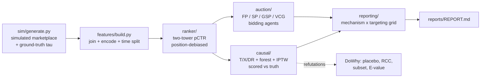

# marketplace-uplift-auction

An end-to-end experiment in **uplift modeling and ad auction design on a simulated
three-sided delivery marketplace**. The simulator generates ~2M impressions across
consumers, merchants, and dashers with a confounded promo treatment whose
ground-truth causal effect is known by construction; a two-tower ranker produces
position-debiased pCTR; causal estimators (T-/X-/DR-learners, causal forest, IPTW)
are scored against the known truth and stress-tested with DoWhy refutations; and
four auction mechanisms (first-price, second-price, GSP, VCG) allocate sponsored
slots to bidding agents. Because the ground truth exists, every claim in this repo —
confounding, calibration, incentive compatibility, targeting efficiency — is
empirically checkable rather than assumed.



## Quickstart

Requirements: Python 3.11, [uv](https://docs.astral.sh/uv/), Java 17+ (for PySpark).

```sh
make setup        # uv sync (pinned uv.lock)
make all          # lint + test + full pipeline (~20 min): reproduces every number below
```

**Five-minute path** (small scale, 50k impressions — see `notebooks/walkthrough.ipynb`
for the same steps as a notebook):

```sh
make setup
uv run python -m mua.cli generate --scale small
uv run python -m mua.cli features
uv run python -m mua.cli train-ranker --epochs 4
uv run python -m mua.cli score
uv run python -m mua.cli causal --config configs/causal_small.yaml
uv run python -m mua.cli auction --mechanism gsp --rounds 20000
uv run python -m mua.cli experiment --scale small
uv run python -m mua.cli report --scale small   # -> reports/REPORT.md
```

Everything is seeded (42); `make all` reproduces every headline number in this
README from a clean clone. Tests are self-contained (they generate their own small
datasets in tmp) and finish in under 3 minutes.

## Headline results (full run, seed 42)

| Stage | Metric | Value |
|---|---|---|
| Sim | treated share / mean true tau | 35.0% / 0.0237 |
| Ranker | test ROC-AUC / post-calibration ECE | 0.7160 / 0.0014 |
| Causal | ground-truth ATE | 0.0242 |
| Causal | naive ATE (biased baseline) | 0.0308 (+0.0065) |
| Causal | IPTW / DR / forest ATE | 0.0238 / 0.0244 / 0.0245 |
| Causal | best PEHE (X-learner) / best Qini (forest) | 0.0157 / 0.5295 |
| Refutations | placebo p / RCC shift / E-value | 0.9776 / 0.0000 / 2.160 |
| Auction (200k rounds) | revenue: FP / GSP / SP / VCG | 65.6k / 27.5k / 17.8k / 13.8k |
| Experiment | uplift-top-k orders per promo dollar | **0.0529** vs 0.0242 treat-all |
| Experiment | max revenue (FP) / max surplus (VCG) | 6809.8 / 3901.5 |

## Methods

- **Simulation**: confounded logistic propensity (calibrated to 35% treated, never a
  coin flip); heterogeneous `true_tau` (positive for price-sensitive new users,
  negative for loyal low-sensitivity users on cheap merchants); ground truth kept in
  a separate `data/truth/` dataset that model code cannot read.
- **Ranker**: two-tower deep model (hashed-ID embeddings + z-scored numerics ->
  MLP [256,128,64]) with a separate position-bias tower trained but zeroed at
  inference; isotonic calibration (ECE <= 0.02 enforced).
- **Causal**: naive diff-in-means, IPTW with GBM propensity + SMD balance checks,
  S-/T-/X-learners, DRLearner, honest CausalForestDML; evaluation vs ground truth
  with ATE bias, CI coverage, PEHE, Qini/AUUC; DoWhy placebo / random-common-cause /
  data-subset refutations plus E-value sensitivity.
- **Auction**: eCPM ranking with reserve price and an ads-load cap (<= 3 sponsored
  slots in a 20-item slate); first-price with multiplicative-weights bid shading,
  budget pacing via a dual-variable λ (spend within ±5% of budget), and
  property-based checks that payments never exceed bids and allocations are valid.

## Interpreting the results

- **The confounding is real and the estimators fix it.** The naive estimator
  overshoots the true ATE (0.0242) by +0.0065 because high-tau units are
  over-represented in treatment; IPTW, DR, and the causal forest all land within
  ±0.001 of truth, and every DoWhy refutation passes.
- **Targeting beats reach.** Ranking sessions by predicted CATE and promoting the
  top 20% yields 0.0529 incremental orders per promo dollar — more than double
  treat-everyone (0.0242) and better than propensity targeting (0.0493). The
  mechanism choice barely moves promo efficiency; the targeting policy does.
- **Revenue and surplus are a menu, not a free lunch.** First-price extracts the
  most platform revenue (shading agents keep surplus thin); VCG leaves the most
  advertiser surplus and is incentive-compatible by construction; GSP sits in
  between as the practical default.

## Limitations

- Everything runs on **simulated data with a known generative model**; results do
  not transfer to any real marketplace.
- **No interference or spillover**: consumers are independent, the promo decision
  does not feed back into the auction, and advertisers follow fixed behavioral
  rules rather than strategic equilibria.
- The auction model is position-free (no slot-specific CTR multipliers), and the
  outcome models are linear-probability-style simplifications.
- Refutation verdicts are necessary, not sufficient, evidence for identification.

See `docs/METHODOLOGY.md` for the full research note and `reports/REPORT.md` for the
complete experiment report. Cite via `CITATION.cff`; MIT licensed.

## Layout

```
src/mua/
  sim/        data generator with known ground truth
  features/   join, encode, time-based splits
  ranker/     two-tower pCTR model + training + calibration + scoring
  causal/     propensity, ATE/CATE estimators, evaluation, DoWhy refutations, policy
  auction/    mechanisms, bidding agents, simulator
  reporting/  experiment grid, figures, REPORT.md
configs/      YAML for every stage (causal_small.yaml = 5-minute path)
notebooks/    walkthrough.ipynb (reproduces the pipeline at small scale)
tests/        82 tests, ~95% coverage, < 3 minutes
```

CI (`.github/workflows/ci.yml`) runs ruff + black + mypy, pytest with a >= 80%
coverage gate, and a full small-scale end-to-end job that uploads
`reports/REPORT.md` as an artifact.
