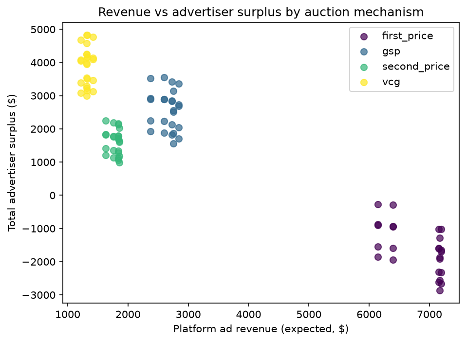
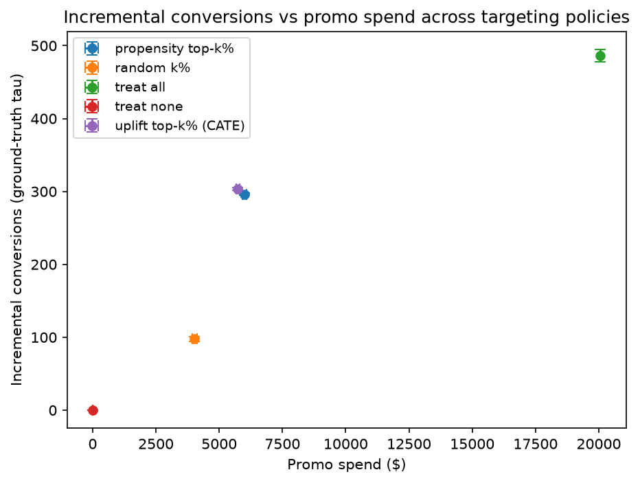
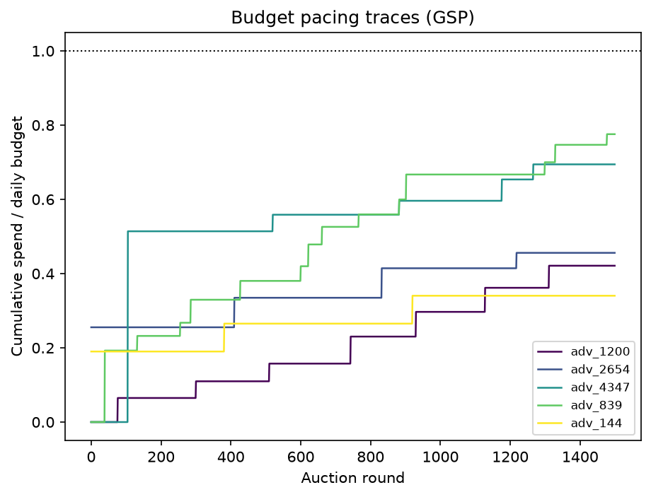
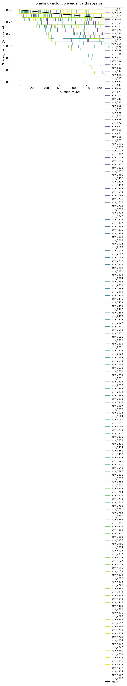
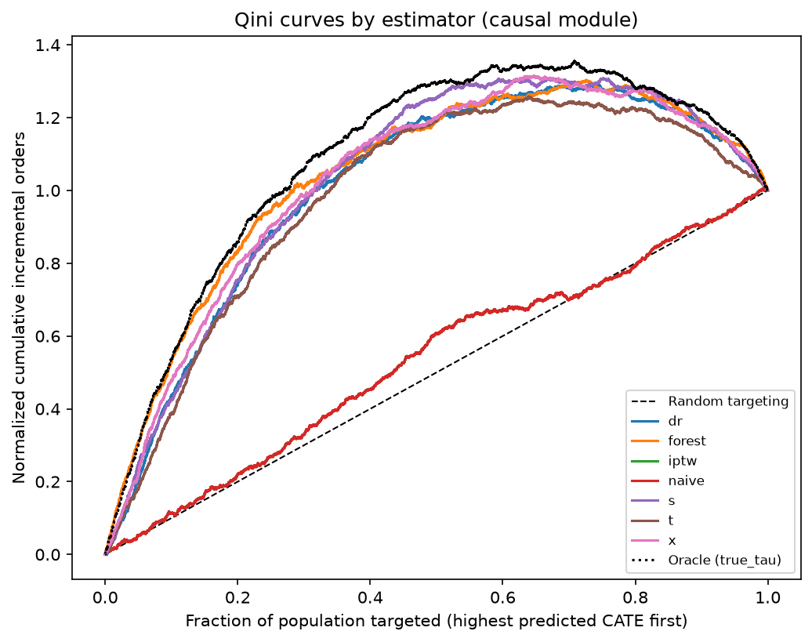

# Marketplace uplift x auction experiment report

## Methodology

The experiment runs the full cross product of 4 auction mechanisms (first_price, second_price, gsp, vcg) x 5 promo targeting policies (treat_none, treat_all, random_k, uplift_top_k from the best CATE model, propensity_top_k) with 5 random seeds per cell; each cell simulates 5 rounds sampled from the scored test log.

- Each round samples a 20-merchant slate from `data/scored/test/`; advertisers (merchants with `is_ads_advertiser`) bid with the configured agent mix (truthful, shading, budget-paced, random) and the mechanism allocates up to 3 sponsored slots ranked by eCPM = bid x pCTR.
- Platform metrics: expected ad revenue = sum(payment x pCTR); consumer welfare proxy = mean relevance of the final shown slate (organic relevance minus what ads displace); advertiser surplus = sum((session value - payment) x pCTR), where the session value scales the merchant's value-per-click by the session's promo-boosted order probability.
- Promo metrics: each round also carries one promo session (a sampled test row joined to the ground-truth tau and baseline order probability from `data/truth/`). The targeting policy decides whether the session is treated; incremental conversions = treated x (clipped(baseline + tau) - baseline), computed both from the ground truth and from the CATE model for validation.

The best CATE model selected for `uplift_top_k` is `x` (leaderboard rank 1 by PEHE). Full per-seed grid: `results.csv`.

## Causal DAG

```dot
digraph causal_dag {
  promo_treated -> ordered;
  merchant_id -> promo_treated; merchant_id -> ordered;
  consumer_id -> promo_treated; consumer_id -> ordered;
  hour_of_day -> promo_treated; hour_of_day -> ordered;
  day_of_week -> promo_treated; day_of_week -> ordered;
  is_peak -> promo_treated; is_peak -> ordered;
  slate_rank -> promo_treated; slate_rank -> ordered;
  consumer_merchant_distance_km -> promo_treated; consumer_merchant_distance_km -> ordered;
  current_dasher_supply_ratio -> promo_treated; current_dasher_supply_ratio -> ordered;
  estimated_delivery_time_min -> promo_treated; estimated_delivery_time_min -> ordered;
  price_sensitivity -> promo_treated; price_sensitivity -> ordered;
  order_frequency_prior -> promo_treated; order_frequency_prior -> ordered;
  distance_tolerance_km -> promo_treated; distance_tolerance_km -> ordered;
  is_new_user -> promo_treated; is_new_user -> ordered;
  tenure_days -> promo_treated; tenure_days -> ordered;
  consumer_x_km -> promo_treated; consumer_x_km -> ordered;
  consumer_y_km -> promo_treated; consumer_y_km -> ordered;
  avg_rating -> promo_treated; avg_rating -> ordered;
  avg_prep_time_min -> promo_treated; avg_prep_time_min -> ordered;
  price_tier -> promo_treated; price_tier -> ordered;
  historical_ctr -> promo_treated; historical_ctr -> ordered;
  is_ads_advertiser -> promo_treated; is_ads_advertiser -> ordered;
  merchant_x_km -> promo_treated; merchant_x_km -> ordered;
  merchant_y_km -> promo_treated; merchant_y_km -> ordered;
  cuisine_american -> promo_treated; cuisine_american -> ordered;
  cuisine_burgers -> promo_treated; cuisine_burgers -> ordered;
  cuisine_chinese -> promo_treated; cuisine_chinese -> ordered;
  cuisine_dessert -> promo_treated; cuisine_dessert -> ordered;
  cuisine_indian -> promo_treated; cuisine_indian -> ordered;
  cuisine_italian -> promo_treated; cuisine_italian -> ordered;
  cuisine_korean -> promo_treated; cuisine_korean -> ordered;
  cuisine_mexican -> promo_treated; cuisine_mexican -> ordered;
  cuisine_pizza -> promo_treated; cuisine_pizza -> ordered;
  cuisine_sushi -> promo_treated; cuisine_sushi -> ordered;
  cuisine_thai -> promo_treated; cuisine_thai -> ordered;
  cuisine_vietnamese -> promo_treated; cuisine_vietnamese -> ordered;
}
```

## Estimator leaderboard (held-out test split, vs ground truth)

| estimator | ATE | ATE bias | covers truth | PEHE | Qini | AUUC |
|---|---|---|---|---|---|---|
| x | 0.0246 | +0.0003 | False | 0.0157 | 0.5164 | 0.0241 |
| forest | 0.0245 | +0.0003 | True | 0.0164 | 0.5295 | 0.0240 |
| s | 0.0214 | -0.0028 | False | 0.0187 | 0.5178 | 0.0243 |
| dr | 0.0244 | +0.0002 | True | 0.0199 | 0.4979 | 0.0238 |
| t | 0.0248 | +0.0006 | False | 0.0252 | 0.4720 | 0.0236 |
| naive | 0.0308 | +0.0065 | False | 0.0453 | 0.0314 | 0.0149 |
| iptw | 0.0238 | -0.0004 | True | 0.0453 | 0.0314 | 0.0149 |

## Refutation verdicts (DoWhy)

# Refutation report

- Estimand: ATE of `promo_treated` on `ordered`
- Estimate (backdoor linear regression): **0.0251**
- Observed outcome rates: treated 0.0986, control 0.0702
- DAG written to `/Users/abhiramkasireddi/MarketplaceUpliftAuction/reports/causal_dag.dot`

| refuter | estimated effect | refuted effect | metric | threshold | verdict |
|---|---|---|---|---|---|
| placebo_treatment (permute) | 0.0251 | 0.0002 | placebo p-value = 0.9776 (zero under placebo null) | p > 0.05 | PASS |
| random_common_cause | 0.0251 | 0.0251 | relative shift = 0.0000 | shift <= 0.2 | PASS |
| data_subset | 0.0251 | 0.0251 | all subset shifts <= tolerance | shift <= 0.2 | PASS |
| unobserved_common_cause (sensitivity) | 0.0251 | n/a | E-value = 2.160 | E-value >= 1.1 | PASS |

## Sensitivity

To fully explain away the observed effect, an unmeasured confounder would need to be associated with both treatment and outcome by a risk ratio of at least **2.16** (E-value).

## Auction results grid (mean ± std across seeds)

| mechanism | policy | revenue | advertiser surplus | consumer welfare | inc conv (truth) | promo spend | per dollar (truth) | per dollar (model) |
|---|---|---|---|---|---|---|---|---|
| first_price | propensity_top_k | 6809.8058 ± 502.4045 | -1410.1296 ± 458.4524 | 0.0953 ± 0.0002 | 296.3240 ± 1.6512 | 6012.1660 ± 88.1832 | 0.0493 ± 0.0006 | 0.0421 ± 0.0005 |
| first_price | random_k | 6809.8058 ± 502.4045 | -2068.0691 ± 463.4026 | 0.0953 ± 0.0002 | 97.6144 ± 3.3765 | 4027.1960 ± 98.3018 | 0.0242 ± 0.0003 | 0.0246 ± 0.0003 |
| first_price | treat_all | 6809.8058 ± 502.4045 | -776.4798 ± 465.8544 | 0.0953 ± 0.0002 | 486.3923 ± 9.1211 | 20067.4820 ± 7.3489 | 0.0242 ± 0.0005 | 0.0246 ± 0.0004 |
| first_price | treat_none | 6809.8058 ± 502.4045 | -2387.8370 ± 456.6557 | 0.0953 ± 0.0002 | 0.0000 ± 0.0000 | 0.0000 ± 0.0000 | nan ± nan | nan ± nan |
| first_price | uplift_top_k | 6809.8058 ± 502.4045 | -1383.2046 ± 450.3632 | 0.0953 ± 0.0002 | 303.1522 ± 1.8855 | 5734.2320 ± 72.1802 | 0.0529 ± 0.0005 | 0.0504 ± 0.0005 |
| gsp | propensity_top_k | 2659.2871 ± 179.6470 | 2763.3776 ± 161.5401 | 0.0953 ± 0.0002 | 296.3240 ± 1.6512 | 6012.1660 ± 88.1832 | 0.0493 ± 0.0006 | 0.0421 ± 0.0005 |
| gsp | random_k | 2659.2871 ± 179.6470 | 2101.6714 ± 156.4979 | 0.0953 ± 0.0002 | 97.6144 ± 3.3765 | 4027.1960 ± 98.3018 | 0.0242 ± 0.0003 | 0.0246 ± 0.0003 |
| gsp | treat_all | 2659.2871 ± 179.6470 | 3399.2820 ± 162.9799 | 0.0953 ± 0.0002 | 486.3923 ± 9.1211 | 20067.4820 ± 7.3489 | 0.0242 ± 0.0005 | 0.0246 ± 0.0004 |
| gsp | treat_none | 2659.2871 ± 179.6470 | 1780.2422 ± 150.0149 | 0.0953 ± 0.0002 | 0.0000 ± 0.0000 | 0.0000 ± 0.0000 | nan ± nan | nan ± nan |
| gsp | uplift_top_k | 2659.2871 ± 179.6470 | 2789.8843 ± 152.0790 | 0.0953 ± 0.0002 | 303.1522 ± 1.8855 | 5734.2320 ± 72.1802 | 0.0529 ± 0.0005 | 0.0504 ± 0.0005 |
| second_price | propensity_top_k | 1783.5214 ± 92.9023 | 1733.5607 ± 83.2200 | 0.0912 ± 0.0001 | 296.3240 ± 1.6512 | 6012.1660 ± 88.1832 | 0.0493 ± 0.0006 | 0.0421 ± 0.0005 |
| second_price | random_k | 1783.5214 ± 92.9023 | 1308.6220 ± 85.4289 | 0.0912 ± 0.0001 | 97.6144 ± 3.3765 | 4027.1960 ± 98.3018 | 0.0242 ± 0.0003 | 0.0246 ± 0.0003 |
| second_price | treat_all | 1783.5214 ± 92.9023 | 2148.9657 ± 82.0620 | 0.0912 ± 0.0001 | 486.3923 ± 9.1211 | 20067.4820 ± 7.3489 | 0.0242 ± 0.0005 | 0.0246 ± 0.0004 |
| second_price | treat_none | 1783.5214 ± 92.9023 | 1100.4263 ± 83.0720 | 0.0912 ± 0.0001 | 0.0000 ± 0.0000 | 0.0000 ± 0.0000 | nan ± nan | nan ± nan |
| second_price | uplift_top_k | 1783.5214 ± 92.9023 | 1752.6508 ± 78.2106 | 0.0912 ± 0.0001 | 303.1522 ± 1.8855 | 5734.2320 ± 72.1802 | 0.0529 ± 0.0005 | 0.0504 ± 0.0005 |
| vcg | propensity_top_k | 1318.9365 ± 71.5750 | 4098.0749 ± 110.2948 | 0.0953 ± 0.0002 | 296.3240 ± 1.6512 | 6012.1660 ± 88.1832 | 0.0493 ± 0.0006 | 0.0421 ± 0.0005 |
| vcg | random_k | 1318.9365 ± 71.5750 | 3436.3667 ± 96.2184 | 0.0953 ± 0.0002 | 97.6144 ± 3.3765 | 4027.1960 ± 98.3018 | 0.0242 ± 0.0003 | 0.0246 ± 0.0003 |
| vcg | treat_all | 1318.9365 ± 71.5750 | 4733.4852 ± 108.1746 | 0.0953 ± 0.0002 | 486.3923 ± 9.1211 | 20067.4820 ± 7.3489 | 0.0242 ± 0.0005 | 0.0246 ± 0.0004 |
| vcg | treat_none | 1318.9365 ± 71.5750 | 3115.2558 ± 88.0306 | 0.0953 ± 0.0002 | 0.0000 ± 0.0000 | 0.0000 ± 0.0000 | nan ± nan | nan ± nan |
| vcg | uplift_top_k | 1318.9365 ± 71.5750 | 4124.2951 ± 102.5556 | 0.0953 ± 0.0002 | 303.1522 ± 1.8855 | 5734.2320 ± 72.1802 | 0.0529 ± 0.0005 | 0.0504 ± 0.0005 |

## Figures

*Revenue vs advertiser surplus by mechanism*

*Incremental conversions vs promo spend frontier*

*Budget pacing traces*

*First-price shading-factor convergence*

*Qini curves by estimator*

## Findings

- **Incremental conversions per promo dollar is maximized by `uplift_top_k` targeting**: 0.0529 orders/$. For comparison: `uplift_top_k` = 0.0529, `propensity_top_k` = 0.0493, `treat_all` = 0.0242, `random_k` = 0.0242. The CATE model behind `uplift_top_k` is `x` (leaderboard rank 1 by PEHE).
- **Revenue/surplus tradeoff:** `first_price` extracts the most platform revenue (mean 6809.8), while `vcg` leaves the most advertiser surplus (mean 3901.5). Advertiser welfare in first-price is driven by shading agents, not by truthful bidding.
- **Consumer welfare** (mean relevance of the shown slate) is highest under `first_price` (0.0953) and varies little across mechanisms, because all mechanisms allocate by the same eCPM ranking; the remaining differences come from bidder strategy.
- **Recommended combination:** targeting policy is the dominant lever for incremental conversions per dollar and is orthogonal to the auction mechanism; combine the best per-dollar policy above with `gsp` as the practical ads default (Vickrey-style pricing with second-price surplus properties), switching to `first_price` only when platform revenue is prioritized over advertiser surplus, and to `vcg` for the most efficient (incentive-compatible) allocation.

## Limitations

- All results are on **simulated data** with a **known generative model**; the CATE/PEHE comparisons benefit from ground truth that does not exist in production.
- **No interference or spillover**: consumers are treated independently, promo effects are session-local, and the auction does not feed back into the promo decision. Real marketplaces exhibit cross-consumer and cross-channel effects.
- Advertiser demand is modeled with fixed values per click plus simple learning agents; there are no strategic bidder dynamics beyond the shading/pacing rules.
- Incremental conversions use expected (probability-level) accounting against the simulator's structural models, not observed causal effects on real users.

